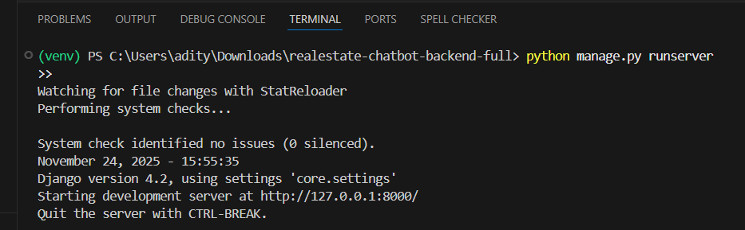
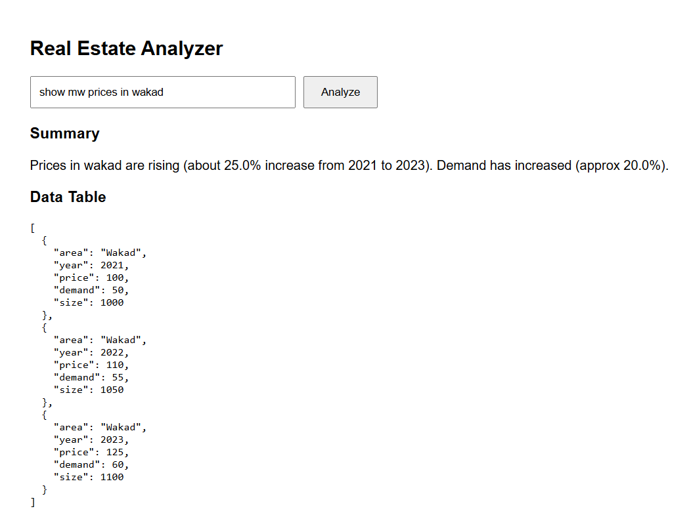

# Real Estate Chatbot Analyzer 🏠🤖

This project is a **full-stack Real Estate Analyzer** that takes natural language queries
(e.g., *"show me prices in Wakad"*) and returns:

✅ Summary insights  
✅ Price & demand trend data  
✅ Data table  
✅ API-powered results using Django backend & React frontend

---

## 🚀 Tech Stack

### Backend (Django)
- Django REST Framework
- Python 3
- Custom API endpoint: `/api/analyze/`

### Frontend (React)
- Axios for API calls
- Responsive UI
- Data rendering

---

## 📸 Screenshots

### ✅ VS Code – Frontend Running


### ✅ VS Code – Backend Running


### ✅ Frontend UI (Home Page)


### ✅ Query Result Page


### ✅ Django Server Running


---

## 🛠️ How to Run

### FrontEnd
```bash
cd realestate-chatbot-backend-full
venv\Scripts\activate
python manage.py runserver
### FrontEnd
```bash
cd simple-frontend
npm install
npm start


venv\Scripts\activate
python manage.py runserver
